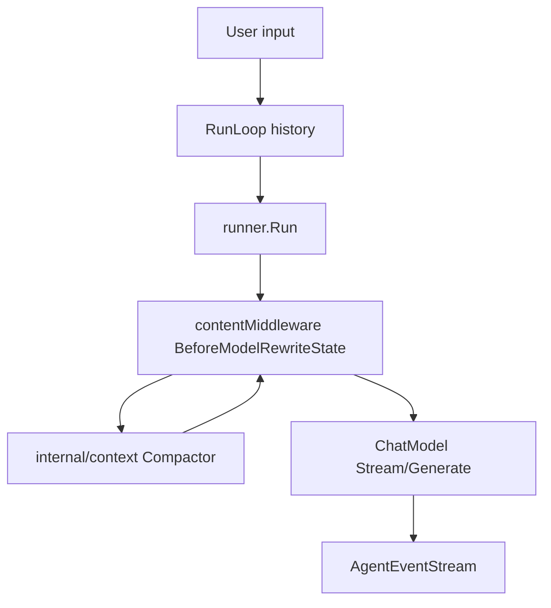

# HappyLadySauceCLI 上下文处理设计规范

本文档描述 HappyLadySauceCLI 的上下文处理 v1 设计。设计参考 Hermes 的长会话能力，但不照搬 Hermes 的配置和插件模型；本项目优先贴合 **Go + Eino ADK** 的实现方式。

Eino 中间件 API 细节见 [middleware-guide.md](../eino/middleware-guide.md)。

---

## 文档索引

| 文档 | 内容 |
|------|------|
| [compression.md](./compression.md) | v1 上下文压缩机制、包边界、middleware 挂载点 |
| [memory.md](./memory.md) | 持久记忆、skills、session search 的分层设计 |
| [sessions.md](./sessions.md) | SQLite 会话存储与检索规划 |
| [prompt-caching.md](./prompt-caching.md) | Prompt caching 后续规划，不属于 v1 |
| [configuration.md](./configuration.md) | v1 用户可见配置 |

---

## v1 设计原则

1. **压缩策略默认化**  
   用户不需要配置阈值、tail/head 数量、字符估算等底层参数。压缩器使用内部默认策略。

2. **Eino middleware 负责挂载点**  
   所有需要修改 `state.Messages` 的逻辑都通过 `BeforeModelRewriteState` 接入。

3. **业务算法放普通包**  
   token 估算、边界选择、摘要生成、tool pair 修复放在 `internal/context`，方便单元测试和复用。

4. **CLI 主循环不做压缩策略**  
   `interactive.go` 维护输入、history、runner 和输出流，不做 context compaction 决策。

5. **失败安全**  
   摘要失败不丢弃消息，不中断 agent；记录英文 warning 并继续使用原始 state。

---

## 架构总览



### 数据流

1. `RunLoop` 接收用户输入并追加到 `history`。
2. `runner.Run(ctx, history)` 进入 Eino ReAct loop。
3. 每次模型调用前，`contentMiddleware.BeforeModelRewriteState` 调用 `internal/context.Compactor`。
4. 如果需要压缩，middleware 返回拷贝后的 `state`，替换 `Messages`。
5. 模型事件通过 `AgentEventStream` 输出，最终 assistant message 追加回 `history`。

---

## 包职责

```text
internal/agents/
  interactive.go       # CLI agent loop
  agent_events.go      # ADK AgentEvent -> AgentEventStream

internal/context/
  compact.go           # Compactor
  usage.go             # token/字符估算
  boundary.go          # head/middle/tail
  assemble.go          # message 组装

internal/middlewares/
  content.go           # Eino middleware adapter

internal/terminal/
  renderer.go          # AgentEventStream 的终端实现
```

---

## 与 Hermes 的取舍

| Hermes 能力 | v1 处理 |
|-------------|---------|
| ContextCompressor | 保留思想，Go 实现为 `internal/context.Compactor` |
| 双层压缩触发 | 不照搬；v1 只保留 Eino middleware 主入口 |
| 可插拔 context engine | 暂不做 |
| 大量 compression 配置 | 暂不暴露给用户 |
| 辅助摘要模型 | 暂不做，先复用主模型 |
| Prompt caching | 后续独立设计 |
| Persistent memory | 可以保留，但配置收敛到 `memory.enabled` |
| Session storage/search | 后续实现，不阻塞 v1 compaction |

---

## 什么时候使用 Middleware

使用 Eino middleware：

- 修改 `state.Messages`
- 修改模型可见工具 schema
- 包装模型调用或工具调用
- 基于 Eino state 记录 usage / metrics

不要使用 middleware：

- 文件读写
- 数据库 CRUD
- 压缩算法本身
- memory store
- session search
- prompt cache 判定规则

这些应放普通 Go package。

---

## 现有代码锚点

| 文件 | 角色 |
|------|------|
| [`internal/agents/interactive.go`](../../internal/agents/interactive.go) | CLI 主循环；维护 `history` |
| [`internal/agents/agent_events.go`](../../internal/agents/agent_events.go) | ADK 事件流到输出流 |
| [`internal/middlewares/content.go`](../../internal/middlewares/content.go) | context compaction 的 Eino 挂载点 |
| [`pkg/options/model.go`](../../pkg/options/model.go) | `MaxModelContext` 与 `MaxOutputTokens` |
| [`pkg/config/config.go`](../../pkg/config/config.go) | 全局配置聚合 |
| [`docs/eino/middleware-guide.md`](../eino/middleware-guide.md) | Eino handler API 指南 |

---

## v1 当前状态

1. `internal/context.Compactor` 已实现内部水位、token 估算、边界选择、摘要生成和消息组装。
2. `internal/middlewares/content.go` 已通过 `BeforeModelRewriteState` 接入 compactor。
3. `internal/agents/interactive.go` 已注册 content handler，并将 `MaxOutputTokens` 传入模型输出上限。
4. 当前压缩只影响单次模型调用的可见 messages，不回写 `RunLoop` 完整 history。
5. Normalize / Prune、prompt caching、session search、独立摘要模型属于后续迭代。
