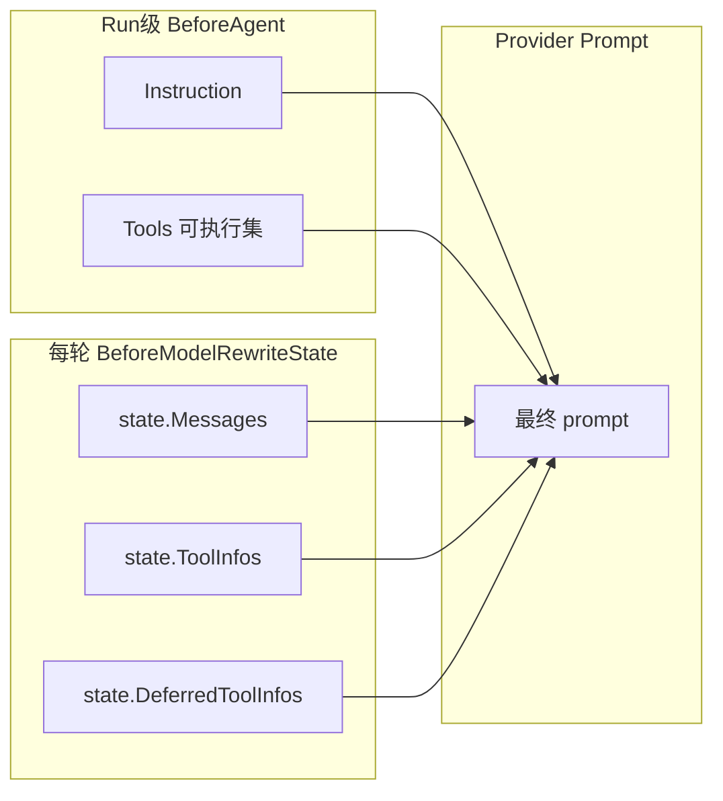
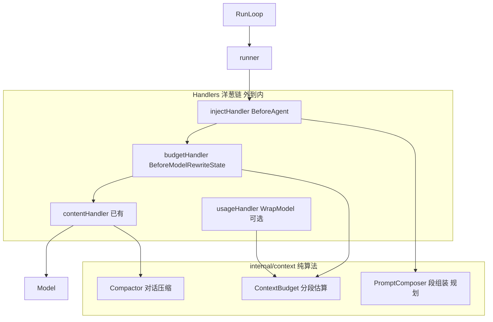
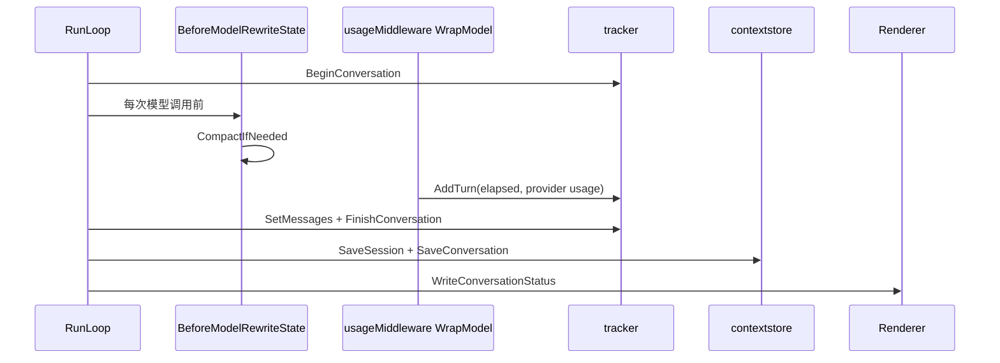

# 精细上下文管理架构

本文档描述 HappyLadySauceCLI 如何借助 Eino ADK 中间件生命周期，将 Cursor 式「分段上下文」映射到可观测、可策略化的架构。算法放在 `internal/context`，Eino 挂载点放在 `internal/middlewares`，终端呈现通过状态行输出。

相关文档：[总览](./README.md) · [压缩](./compression.md) · [记忆](./memory.md) · [Eino 中间件指南](../eino/middleware-guide.md)

---

## 1. 目标与参照

Cursor「Context Usage」面板将 prompt 拆成七段并分别统计 token：

| 分段 | 典型内容 |
|------|----------|
| System prompt | 主 system instruction |
| Tool definitions | 工具 JSON Schema |
| Rules | 项目/用户规则 |
| Skills | 按需加载的技能说明 |
| MCP | MCP 工具与资源描述 |
| Subagent definitions | 子 agent 元数据 |
| Conversation | 多轮对话 + tool trace |

HappyLadySauceCLI 是 **Go + Eino ADK** 终端 CLI，无法复刻 IDE 面板，但使用同一套**分段预算模型**驱动统计、告警与未来的按段裁剪策略。终端呈现采用**状态行**（如 `[context 41% | conv 32.6k | tools 8.6k | sys 0.5k]`）。

---

## 2. Eino 中「上下文」的真实组成

Eino `ChatModelAgent` 每次模型调用前，provider 实际收到的 prompt 由以下部分拼装（顺序因 provider 而异，但逻辑分段稳定）：



**关键约束**（来自 [middleware-guide.md](../eino/middleware-guide.md)）：

- 改 **整次 Run** 的 system / 可执行工具 → `BeforeAgent`（`ChatModelAgentContext`）
- 改 **每轮模型可见** 消息与 tool schema → `BeforeModelRewriteState`（`ChatModelAgentState`）
- **禁止**在 `WrapModel` 中改 messages 或 `model.WithTools`（不持久化、破坏 prompt cache）

---

## 3. 七段对齐表（Canonical Segment Map）

以下为项目内**权威**分段定义与 Eino 挂载点对齐表。新增 Handler 或预算逻辑必须与此表一致。

| 分段 ID | 用户可见名 | Eino 数据源 | 统计输入 | 策略钩子 | 当前状态 |
|---------|-----------|-------------|----------|----------|----------|
| `system` | System prompt | `ChatModelAgentConfig.Instruction` | `BudgetInput.Instruction` | `BeforeAgent` | 静态 `prompts.SystemPrompt`；已纳入 `ContextBudget` |
| `tools` | Tool definitions | `state.ToolInfos` | `BudgetInput.ToolInfos` | `BeforeModelRewriteState` | weather 工具；压缩触发已计数；不可动态裁剪 |
| `rules` | Rules | 合成进 Instruction 的 rules 块 | `BudgetInput.RulesText` | `BeforeAgent` | 未实现加载器；预算口径已预留 |
| `skills` | Skills | Instruction 索引 + 按需消息正文 | `BudgetInput.SkillsText` | `BeforeAgent` + 工具/消息 | 见 [memory.md](./memory.md)；预算口径已预留 |
| `mcp` | MCP | `Tools` + `ToolInfos` 中 MCP 来源部分 | `BudgetInput.MCPText` 或标记的 tool 子集 | `BeforeAgent` / `BeforeModelRewriteState` | 未实现 |
| `subagents` | Subagent definitions | 多 Agent / Graph 元数据 | `BudgetInput.SubagentsText` | `BeforeAgent` / 独立 Runner | 单 Agent；口径已预留 |
| `conversation` | Conversation | `state.Messages` | `BudgetInput.Messages` | `BeforeModelRewriteState` | 已实现 `contentMiddleware` → `Compactor` |

### 3.1 BeforeAgent vs BeforeModelRewriteState 决策

| 需求 | 使用钩子 | 修改对象 | 持久范围 |
|------|----------|----------|----------|
| 会话启动组合 system（base + memory + rules） | `BeforeAgent` | `runCtx.Instruction` | 整次 `Run()` |
| 注册 MCP / 额外可执行工具 | `BeforeAgent` | `runCtx.Tools` | 整次 `Run()` |
| 每轮裁剪对话历史 / 语义压缩 | `BeforeModelRewriteState` | `state.Messages` | 当前及后续模型调用 |
| 每轮缩减模型可见 tool schema | `BeforeModelRewriteState` | `state.ToolInfos`、`state.DeferredToolInfos` | 当前及后续模型调用 |
| 分段 token 估算与状态行 | `BeforeModelRewriteState` | 只读 state + Run 级 instruction 快照 | 经 `context.Context` 传出 |

### 3.2 当前已接线路径

```text
RunLoop history
  → runner.Run(ctx, history)
  → [每次模型调用]
       BeforeModelRewriteState (contentMiddleware)
         → Compactor.CompactIfNeeded(ctx, messages)
         → 若 provider session total 超 80% safe budget → head + summary + tail
  → 模型 / 工具循环
  → 仅最后 assistant 回写 history
```

现有压缩触发不再本地估算 `messages + toolInfos`，而是读取 `tracker.TotalTokens()` 中最近一次 provider total。后续分段预算只用于观测与策略分析，不作为当前压缩触发真相源。

### 3.3 与 Cursor 的差异

| 维度 | Cursor IDE | HappyLadySauceCLI (Eino) |
|------|------------|--------------------------|
| 分段来源 | Harness 预加载 rules/skills/MCP | 自行在 `BeforeAgent` / 工具层组装 |
| 统计时机 | 会话级静态 + 对话动态 | 每次 `BeforeModelRewriteState` 重算 |
| 压缩作用域 | IDE 内部 transcript | 仅当次 `state.Messages`；不回写 RunLoop `history` |
| UI | 模态面板 | 终端状态行 |

---

## 4. 目标架构：分段预算 + 中间件链

核心思想：**算法在普通包，挂载点在 Eino Handlers，观测经 context 传播**。



### 4.1 Handler 职责（演进目标）

| Handler | 钩子 | 职责 |
|---------|------|------|
| **injectHandler** | `BeforeAgent` | 组合 Instruction = base + memory + rules；注册 MCP/额外 tools |
| **budgetHandler** | `BeforeModelRewriteState` | 演进目标：调用 `ContextBudget.Estimate`，`WithBudgetSnapshot` 写入 ctx |
| **contentHandler** | `BeforeModelRewriteState` | **已有**：对话语义压缩 |
| **toolPolicyHandler** | `BeforeModelRewriteState` | 按意图缩减 `ToolInfos` / `DeferredToolInfos` |
| **usageHandler** | `WrapModel` | **已有**：读取 provider usage，追加 Turn 并聚合 Conversation |

注册顺序（外→内）：`inject → budget → content → toolPolicy`；`usage` 靠内层。

### 4.2 ContextBudget API（演进目标）

当前第一版先落地 `internal/context/model` + `internal/context/usage` + `internal/context/tracker` 的 Turn/Conversation/Session 计量；分段预算仍是后续演进目标。

```go
type Segment string

const (
    SegmentSystem       Segment = "system"
    SegmentTools        Segment = "tools"
    SegmentRules        Segment = "rules"
    SegmentSkills       Segment = "skills"
    SegmentMCP          Segment = "mcp"
    SegmentSubagents    Segment = "subagents"
    SegmentConversation Segment = "conversation"
)

type ContextBudget struct {
    MaxTokens   int
    TotalTokens int
    Segments    map[Segment]int
    PercentFull float64
}
```

`BudgetInput` 聚合每次估算所需的明文与各段来源；`EstimateBudget` 复用 `TokenEstimator`。

### 4.3 Conversation → 状态行传递契约（已实现）

见 [`internal/context/usage/usage.go`](../../internal/context/usage/usage.go)、[`internal/context/tracker/tracker.go`](../../internal/context/tracker/tracker.go) 与 [`internal/terminal/context_status.go`](../../internal/terminal/context_status.go)。



**契约规则：**

1. **写入方**：`usageMiddleware.WrapModel` 在每次 `Generate`/`Stream` 完成后追加 `Turn`。
2. **聚合方**：`tracker` 聚合一次 ChatModelAgent Run 内的全部 turns，并保存本轮 user/assistant/tool 消息快照。
3. **持久化方**：`RunLoop` 使用 `contextstore` 先 upsert session，再 upsert conversation、turns、messages；SQLite 默认路径和连接由 `storage/sqlite` 提供。
4. **渲染方**：`terminal/budget.FormatConversationStatusLine` 生成状态行；`Renderer.WriteConversationStatus` 写入 stderr（不污染 stdout 对话流）。
5. **旁路规则**：辅助摘要调用直调 compactor 持有的裸 `BaseChatModel`，不进入 `usageMiddleware.WrapModel` 计量链。

状态行示例：

```text
[Stats: elapsed=0.77s prompt↑=318 completion↓=37 content↑↓=318 0.25%(128K)]
```

完整七段明细留给未来的 `/context` 命令；当前状态行只展示 Conversation 聚合总量。

---

## 5. 各段策略归属（后续迭代）

| 分段 | 膨胀原因 | 策略钩子 | 策略示例 |
|------|----------|----------|----------|
| System | memory 文件变大 | `BeforeAgent` | 字符上限、会话启动冻结 |
| Tools | 工具过多 | `BeforeModelRewriteState` | 按轮隐藏非相关 tool schema |
| Rules | 规则文件多 | `BeforeAgent` | 只加载 project rules |
| Skills | 全量 skill 描述过大 | 索引 + 按需加载 | system 只放目录索引 |
| MCP | 远程 schema 大 | 懒加载 | 未连接不计入 |
| Subagents | 多 agent 元数据 | Graph / 多 Runner | instruction 只保留摘要 |
| Conversation | 长对话 | `BeforeModelRewriteState` | Hermes 语义压缩（已有） |

**预算公式**（与 Compactor 对齐）：

```text
safe_budget = MaxModelContext - MaxOutputTokens
trigger     = 80% × safe_budget
target      = 60% × safe_budget   # 规划，代码未实现
```

触发与目标应基于**七段总和**，而非仅 conversation + tools。

---

## 6. 现有缺口

1. **budgetHandler 未挂载** — `ContextBudget` API 已就绪，尚未接入 middleware 链。
2. **压缩不回写 history** — RunLoop 累积原始消息，跨 turn 可能重复摘要。
3. **瘦 history** — 跨 turn 无 tool trace。
4. **memory / skills / MCP** — 规划见 `docs/context/`，Go 包未落地。
5. **`ModelContext` 未用** — 可按 call 序号做差异化 tool 过滤。

---

## 7. 演进阶段


- **P0（当前）**：本文档、`ContextBudget`、`budget_ctx` 契约、`FormatContextStatusLine`。
- **P1**：`budgetHandler` 只观测不改 state。
- **P2**：`interactive.go` 在 `FinishTurn` 前调用 `WriteContextStatus`。
- **P3+**：按 [memory.md](./memory.md) 落地 injectHandler。

---

## 8. 结论

在 Eino 中实现 Cursor 级精细上下文管理，需要：

1. **先定义分段**（七段）与每段的 Eino 数据源 + 钩子（见 §3 对齐表）；
2. **用 Handler 链**分离注入 / 估算 / 压缩 / 计量，算法留在 `internal/context`；
3. **用 `WithBudgetSnapshot`** 把预算从 middleware 传到 RunLoop，再驱动终端状态行；
4. **把 Conversation 压缩**视为七段之一——当前仅完成该段部分能力。

现有 [`contentMiddleware`](../../internal/middlewares/content.go) 挂载方式正确；扩展时应**新增 Handler**，并补齐 Instruction 与 `DeferredToolInfos` 的预算口径。
