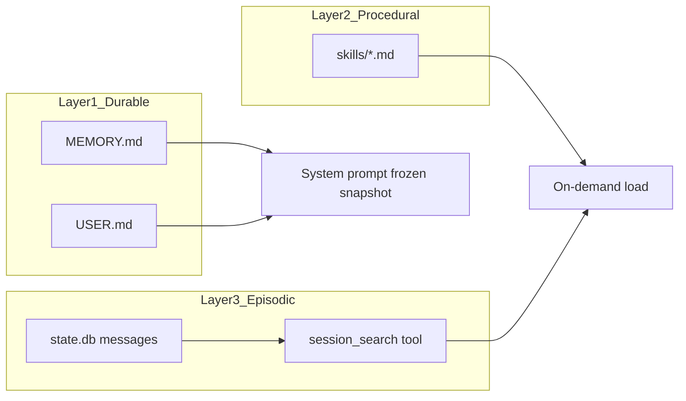

# 三层记忆

本文档定义 HappyLadySauceCLI 的跨会话记忆体系，对标 Hermes 三层架构：**持久记忆**、**程序记忆（Skills）**、**情景记忆（Session Search）**。

相关文档：[总览](./README.md) · [会话存储](./sessions.md) · [压缩引擎](./compression.md)

---

## 1. 设计目标

| 目标 | 说明 |
|------|------|
| 稳定事实常驻 | 用户偏好、项目约定始终在 system prompt 中可用 |
| 按需扩展 | 工作流、历史对话不常驻 prompt，按需加载或检索 |
| 与压缩协同 | 压缩摘要不得覆盖持久记忆的权威性 |
| 有界存储 | 持久记忆文件有字符上限，防止 prompt 膨胀 |

---

## 2. 三层架构



| 层 | 名称 | 存储 | 注入方式 | 延迟 |
|----|------|------|----------|------|
| 1 | 持久记忆（Durable） | `MEMORY.md` / `USER.md` | 会话启动冻结进 system prompt | 0（始终在 prompt） |
| 2 | 程序记忆（Procedural） | `skills/*.md` | Agent 按需加载匹配 Skill | 低（读文件） |
| 3 | 情景记忆（Episodic） | `state.db` | `session_search` FTS 检索 | ~20ms（无 LLM） |

---

## 3. Layer 1：持久记忆

### 3.1 文件定义

| 文件 | 路径 | 用途 |
|------|------|------|
| `MEMORY.md` | `{data_dir}/memories/MEMORY.md` | Agent 笔记：环境事实、项目约定、工具经验 |
| `USER.md` | `{data_dir}/memories/USER.md` | 用户画像：偏好、沟通风格、期望 |

文件不存在时视为空；首次 `memory` 工具写入时自动创建目录与文件。

字符上限、redact 规则、文件锁策略由 `internal/memory` 维护为内部默认，不作为用户配置暴露。

### 3.2 冻结快照规则

对标 Hermes「Frozen snapshot pattern」：

```
会话启动
  │
  ├─ 从磁盘读取 MEMORY.md、USER.md
  ├─ 渲染进 system prompt（一次性）
  └─ 此后整个会话 system prompt 不再 mutate

会话中 memory 工具写入
  │
  ├─ 立即持久化到磁盘（durability）
  ├─ 不更新当轮 system prompt（prefix cache）
  └─ tool 响应返回磁盘上的最新内容

下次会话启动
  └─ 重新加载，新内容进入 system prompt
```

**实现挂载点**：`internal/memory/store.go`（读写）+ `internal/prompts/prompts.go`（渲染模板）。

### 3.3 System Prompt 渲染模板

```markdown
{base_instruction}

## Persistent Memory

### About the User (USER.md)
{user_md_content}

### Agent Notes (MEMORY.md)
{memory_md_content}
```

`{base_instruction}` 为 [`internal/prompts/prompts.go`](../../internal/prompts/prompts.go) 中的基础指令。

### 3.4 memory 工具

**包路径**：`internal/tools/memory/`

**Schema**：

```json
{
  "name": "memory",
  "description": "Manage persistent memory across sessions.",
  "parameters": {
    "type": "object",
    "properties": {
      "action": {
        "type": "string",
        "enum": ["add", "replace", "remove"]
      },
      "target": {
        "type": "string",
        "enum": ["memory", "user"],
        "description": "memory = MEMORY.md, user = USER.md"
      },
      "content": {
        "type": "string",
        "description": "Required for add and replace."
      },
      "old_text": {
        "type": "string",
        "description": "Substring identifying entry for replace/remove."
      }
    },
    "required": ["action", "target"]
  }
}
```

**行为约定**：

| action | 行为 |
|--------|------|
| `add` | 在目标文件末尾追加 `content`（检查字符上限） |
| `replace` | 用 `content` 替换包含 `old_text` 的条目 |
| `remove` | 删除包含 `old_text` 的条目 |

**约束**：

- 写入前检查内部字符上限；超限返回错误，提示 Agent 精简或替换旧条目
- 文件写入使用进程级文件锁，防止并发损坏
- 敏感信息（API key 等）写入前经 redact 检查（规划：`internal/memory/redact.go`）

**Agent 指引**（写入 system prompt 或 tool description）：

- `user`：姓名、角色、偏好、沟通风格
- `memory`：环境路径、项目约定、工具怪癖、学到的经验
- 不要存储临时任务状态（用 session 历史或压缩摘要）
- 不要存储密钥或凭证

---

## 4. Layer 2：程序记忆（Skills）

### 4.1 存储

```
~/.HAPPLADYSAUCECLI/skills/
├── deploy/
│   └── SKILL.md
├── code-review/
│   └── SKILL.md
└── ...
```

### 4.2 Skill 文件格式

```markdown
---
name: deploy
description: Deploy the application to staging or production.
triggers:
  - deploy
  - release
  - staging
---

# Deploy Workflow

## Prerequisites
- ...

## Steps
1. Run `make build`
2. ...

## Pitfalls
- ...

## Verification
- Check health endpoint returns 200
```

### 4.3 加载策略

| 属性 | 值 |
|------|------|
| 常驻 prompt | 否 |
| 触发方式 | Agent 根据 description/triggers 判断相关性后读取 |
| 与 Cursor Skills 关系 | 概念对齐，存储独立，不共享目录 |
| 字符上限 | 单 Skill 建议 ≤ 8000 字符；超长 Skill 应拆分 |

**实现**：`internal/memory/skills.go` 负责枚举、匹配、加载；未来可暴露 `skills` 工具或 slash command。

---

## 5. Layer 3：情景记忆（Session Search）

全量对话历史存储在 SQLite（见 [sessions.md](./sessions.md)），通过 `session_search` 工具按需检索。

| 属性 | 值 |
|------|------|
| 存储 | `~/.HAPPLADYSAUCECLI/state.db` |
| 索引 | FTS5（`messages_fts`） |
| 检索结果 | 原始消息片段，无 LLM 摘要，无截断 |
| 用途 | 「我们上周讨论过 X」「用上次的方法」类查询 |

**与压缩的关系**：

- 压缩丢弃的是**当前 session 中间段的逐字内容**，替换为结构化摘要
- `session_search` 可找回**历史 session 的原始消息**
- 二者互补：压缩保当前任务连贯；session_search 保跨时间召回

---

## 6. 压缩与记忆的优先级

当 [压缩引擎](./compression.md) 生成摘要消息时，必须在摘要前缀中声明以下优先级（对标 Hermes `SUMMARY_PREFIX`）：

```
优先级（高 → 低）：
1. MEMORY.md / USER.md（system prompt 中的冻结快照）
2. Tail 消息（摘要之后的最新对话）
3. 压缩摘要（背景参考，非待执行指令）
```

**Agent 行为约束**：

- 不得因压缩摘要中的旧请求而重复执行已完成任务
- 不得因压缩摘要而忽略 system prompt 中的 memory 内容
- 当前任务以摘要中 `## Progress` / `## Next Steps` 及 tail 中最新 user 消息为准

**压缩后 memory 同步**（规划）：

- 首次压缩成功后，可选提示 Agent 将关键新事实写入 `MEMORY.md`（对标 ClawdBot post-compaction memory sync）
- 此为建议性行为，非强制流水线步骤

---

## 7. 三层记忆选型指南

| 场景 | 推荐层 |
|------|--------|
| 用户偏好、项目技术栈 | Layer 1 `USER.md` / `MEMORY.md` |
| 可复用工作流（部署、审查） | Layer 2 Skills |
| 「上次我们怎么解决的」 | Layer 3 `session_search` |
| 当前任务进度 | 不写入 memory；由压缩摘要 + tail 承载 |
| 临时调试输出 | 不写入 memory；留在 session 历史 |

---

## 8. 数据目录初始化

首次启动时自动创建：

```
{data_dir}/
├── memories/
│   ├── MEMORY.md    # 空文件或带注释头的模板
│   └── USER.md
└── skills/          # 空目录
```

模板头示例（`MEMORY.md`）：

```markdown
# Agent Memory

Curated notes that persist across sessions. Managed via the `memory` tool.
```

---

## 9. 参考

- [Hermes — Persistent Memory](https://hermes-agent.nousresearch.com/docs/user-guide/features/memory)
- [Hermes — memory_tool.py](https://github.com/NousResearch/hermes-agent/blob/main/tools/memory_tool.py)
- [会话存储](./sessions.md)
- [压缩引擎](./compression.md)
