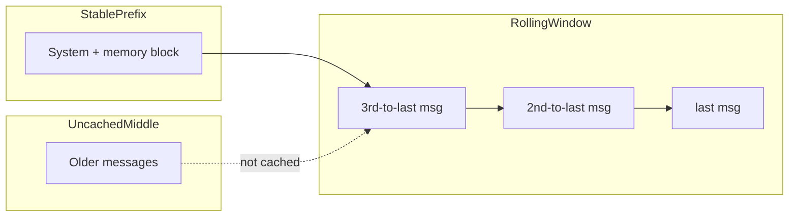
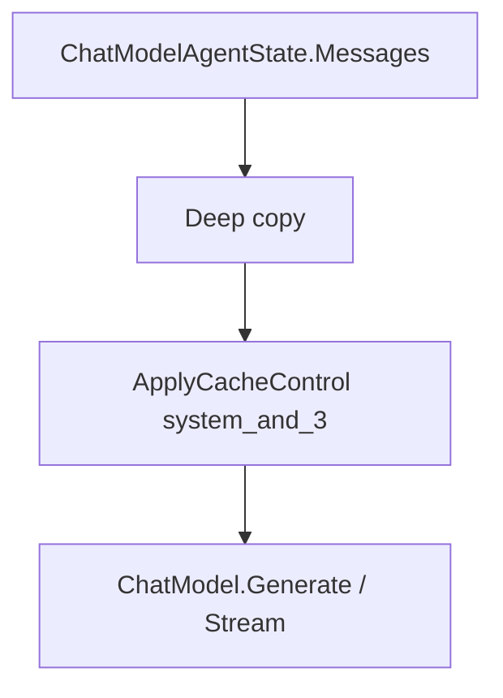

# Prompt 缓存

本文档记录 HappyLadySauceCLI 后续可能支持的 Anthropic Prompt Caching 策略。Prompt caching 不属于 v1 上下文压缩范围，当前不进入用户配置。

相关文档：[总览](./README.md) · [压缩引擎](./compression.md) · [记忆](./memory.md) · [配置](./configuration.md)

---

## 1. 设计目标

| 目标 | 说明 |
|------|------|
| 降低成本 | 多轮对话 input token 费用降低约 75%（Anthropic 缓存命中时） |
| 与冻结快照协同 | System prompt（含 memory 块）作为稳定 cache 断点 |
| 与压缩协同 | 压缩不破坏 system cache；滚动窗口快速重建尾部 cache |
| 后续启用 | 等 context compaction 稳定后再按 provider 能力接入 |

---

## 2. 适用条件

Prompt 缓存后续实现时，建议**自动启用**当且仅当：

1. Provider 支持 `cache_control` 断点（原生 Anthropic API 或兼容网关）
2. 模型为 Anthropic Claude 系列（按 model name 探测）
3. 用户或代码策略允许启用缓存

非 Anthropic 模型：跳过所有 cache 打标逻辑。

启动时输出状态（英文日志）：

```
Prompt caching: ENABLED (Claude via OpenRouter, TTL=5m)
```

或：

```
Prompt caching: DISABLED (model does not support cache_control)
```

---

## 3. system_and_3 策略

Anthropic 每请求最多 **4 个** `cache_control` 断点。本项目采用 Hermes 的 `system_and_3` 布局：

```
Breakpoint 1: System prompt（含冻结 memory 块）
              ── 全轮稳定，命中率最高

Breakpoint 2: 倒数第 3 条非 system 消息  ─┐
Breakpoint 3: 倒数第 2 条非 system 消息   ├─ 滚动窗口
Breakpoint 4: 最后 1 条非 system 消息     ─┘
```



### 3.1 断点打标规则

实现在 `internal/context/caching.go` 的 `ApplyCacheControl()`：

- 对 messages 做**深拷贝**，不修改原始 state
- 按 content 类型注入 `cache_control`：

| Content 类型 | 打标位置 |
|--------------|----------|
| 纯字符串 content | 转为 `[{"type":"text","text":"...","cache_control":{...}}]` |
| content 列表 | 在**最后一个** part 的 dict 上添加 `cache_control` |
| content 为空 | 在 message 顶层添加 `cache_control` |
| tool 消息 | message 顶层 `cache_control`（仅原生 Anthropic） |

**Cache marker 格式**：

```json
{"type": "ephemeral"}
```

TTL 为 1 小时时：

```json
{"type": "ephemeral", "ttl": "1h"}
```

---

## 4. TTL 选择（后续）

| TTL | 适用场景 |
|-----|----------|
| `5m`（默认） | 交互式 CLI，轮次间隔短 |
| `1h` | 长会话，用户轮次间有较长停顿 |

v1 不暴露 `prompt_caching.cache_ttl`。后续如果实现，可先作为内部默认值，确认用户确实需要后再配置化。

---

## 5. 与压缩的交互

### 5.1 System prompt 稳定性

- Memory 冻结快照在会话启动时写入 system prompt，**会话中不 mutate**
- 首次压缩时：在 system 消息末尾追加**一次性**说明（`[Note: earlier turns compacted ...]`）
- 后续压缩：**不再**修改 system 消息

这保证 Breakpoint 1 在首次压缩后仍保持稳定前缀。

### 5.2 压缩对 cache 的影响

```
压缩前：
  [system] [msg1] [msg2] ... [msg40] [msg41] [msg42] [msg43]
   ^BP1                              ^BP2    ^BP3    ^BP4

压缩后（middle 变为 summary）：
  [system] [head] [summary] [tail...]
   ^BP1    新中间段 cache 失效    ^滚动窗口在 1-2 轮内重建
```

- 被摘要替换的中间段：cache **失效**
- System prompt cache：**保留**（前缀未变）
- 滚动 3 消息窗口：压缩后 1–2 轮内重新建立 Breakpoint 2–4

### 5.3 与 memory 工具的交互

- 会话中 `memory` 工具写入磁盘，**不更新** system prompt
- 因此 memory 更新**不会**使 Breakpoint 1 失效
- 新 memory 内容在**下次会话启动**时进入 system prompt 并参与缓存

---

## 6. Cache-Aware 设计模式

| 模式 | 说明 |
|------|------|
| 稳定 system prompt | Breakpoint 1 跨轮复用；避免 mid-session 修改 system |
| 前缀匹配 | Cache 命中要求前缀一致；中间增删消息会使之后断点失效 |
| 消息顺序 | 不在中间插入消息；新消息追加在末尾 |
| 压缩时机 | 由 `internal/context.Compactor` 的内部水位决定，不暴露为用户配置 |
| 深拷贝打标 | `ApplyCacheControl` 不污染 agent state 中的原始 messages |

---

## 7. 集成点



**挂载方式**（二选一，实现时择一）：

1. **`WrapModel` 装饰器**：在真实模型调用前对 input 打标（推荐；不改 state）
2. **Provider option**：若 OpenAI-compatible 客户端支持 cache option，通过 `model.Option` 注入

> 注意：`WrapModel` 中**不得**修改 messages 语义内容，仅做深拷贝 + cache 打标。

---

## 8. 能力探测

```go
// internal/context/caching.go（设计伪代码）

// SupportsPromptCaching reports whether the active provider/model can use cache_control.
// SupportsPromptCaching 判断当前 provider/model 是否支持 cache_control。
func SupportsPromptCaching(modelName, baseURL string) bool {
    // 1. model name matches claude-* pattern
    // 2. baseURL is Anthropic native or known compatible gateway
    // 3. app policy allows caching
}
```

探测结果缓存于会话级，模型切换时重新探测。

---

## 9. 配置

v1 不提供 prompt caching 配置。后续实现前需要先确认目标 provider、OpenAI-compatible 客户端是否支持 `cache_control`，再决定是否暴露配置项。

---

## 10. 参考

- [Hermes — Context Compression and Caching (Prompt Caching 节)](https://hermes-agent.nousresearch.com/docs/developer-guide/context-compression-and-caching)
- [Hermes — prompt_caching.py](https://github.com/NousResearch/hermes-agent/blob/main/agent/prompt_caching.py)
- [Anthropic Prompt Caching](https://docs.anthropic.com/en/docs/build-with-claude/prompt-caching)
- [压缩引擎](./compression.md)
- [记忆 — 冻结快照](./memory.md#32-冻结快照规则)
