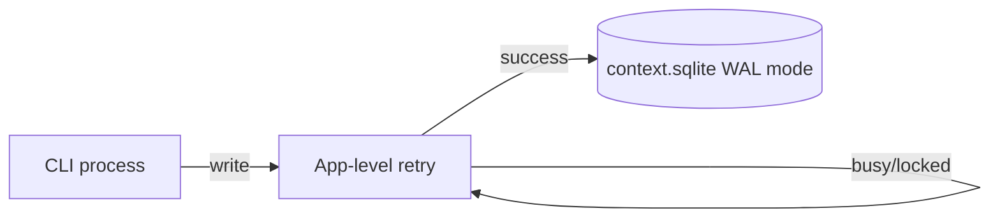

# 会话存储

本文档定义 HappyLadySauceCLI 的会话持久化与检索机制，对标 Hermes SQLite session storage。

相关文档：[总览](./README.md) · [记忆 — Layer 3](./memory.md#layer-3情景记忆session-search) · [配置](./configuration.md)

---

## 1. 设计目标

| 目标 | 说明 |
|------|------|
| 全量保留 | 每条 user/assistant/tool 消息写入数据库 |
| 可恢复 | CLI 重启后可继续上次会话 |
| 可检索 | FTS5 全文搜索跨会话历史 |
| 可追溯 | 压缩导致的 session 拆分通过 `parent_session_id` 链接 |
| 多进程安全 | WAL 模式 + 应用层重试 |

---

## 2. 存储位置

| 资源 | 默认路径 | 说明 |
|------|----------|------|
| SQLite 主库 | `~/.HAPPLADYSAUCECLI/context.sqlite` | context session/conversation/turn/message |
| WAL 文件 | `context.sqlite-wal` | Write-Ahead Log |
| SHM 文件 | `context.sqlite-shm` | 共享内存 |

v1 不暴露 `sessions.db_path`、`DBPath` 或 `data_dir`；默认路径由 `pkg/storage/sqlite` 统一派生。

---

## 3. 数据库 Schema

### 3.1 表结构

```sql
-- schema_version: single-row migration tracker
CREATE TABLE IF NOT EXISTS schema_version (
    version INTEGER NOT NULL
);

-- sessions: conversation metadata
CREATE TABLE IF NOT EXISTS sessions (
    id                TEXT PRIMARY KEY,
    source            TEXT NOT NULL,          -- "cli" for this project
    user_id           TEXT,
    title             TEXT,
    model             TEXT,
    model_config      TEXT,                   -- JSON snapshot
    system_prompt     TEXT,                   -- frozen snapshot at session start
    parent_session_id TEXT REFERENCES sessions(id),
    started_at        TEXT NOT NULL,          -- RFC3339
    ended_at          TEXT,
    end_reason        TEXT,                   -- "user_exit", "compress_split", etc.
    input_tokens      INTEGER DEFAULT 0,
    output_tokens     INTEGER DEFAULT 0,
    estimated_cost    REAL DEFAULT 0.0,
    compression_count INTEGER DEFAULT 0
);

CREATE UNIQUE INDEX IF NOT EXISTS idx_sessions_title_unique
    ON sessions(title) WHERE title IS NOT NULL;

CREATE INDEX IF NOT EXISTS idx_sessions_started
    ON sessions(started_at DESC);

CREATE INDEX IF NOT EXISTS idx_sessions_parent
    ON sessions(parent_session_id);

-- messages: full message history
CREATE TABLE IF NOT EXISTS messages (
    id                INTEGER PRIMARY KEY AUTOINCREMENT,
    session_id        TEXT NOT NULL REFERENCES sessions(id),
    timestamp         TEXT NOT NULL,          -- RFC3339
    role              TEXT NOT NULL,          -- system, user, assistant, tool
    content           TEXT,
    tool_calls        TEXT,                   -- JSON array
    tool_call_id      TEXT,
    tool_name         TEXT,
    finish_reason     TEXT,
    reasoning_content TEXT,
    token_count       INTEGER,
    is_compaction_summary INTEGER DEFAULT 0   -- 1 if this message is a compaction summary
);

CREATE INDEX IF NOT EXISTS idx_messages_session
    ON messages(session_id, timestamp);

-- FTS5 virtual table for full-text search
CREATE VIRTUAL TABLE IF NOT EXISTS messages_fts USING fts5(
    content,
    tool_name,
    content='messages',
    content_rowid='id'
);

-- Triggers to keep FTS in sync
CREATE TRIGGER IF NOT EXISTS messages_ai AFTER INSERT ON messages BEGIN
    INSERT INTO messages_fts(rowid, content, tool_name)
    VALUES (new.id, new.content, new.tool_name);
END;

CREATE TRIGGER IF NOT EXISTS messages_ad AFTER DELETE ON messages BEGIN
    INSERT INTO messages_fts(messages_fts, rowid, content, tool_name)
    VALUES ('delete', old.id, old.content, old.tool_name);
END;

CREATE TRIGGER IF NOT EXISTS messages_au AFTER UPDATE ON messages BEGIN
    INSERT INTO messages_fts(messages_fts, rowid, content, tool_name)
    VALUES ('delete', old.id, old.content, old.tool_name);
    INSERT INTO messages_fts(rowid, content, tool_name)
    VALUES (new.id, new.content, new.tool_name);
END;

-- state_meta: key-value store for app metadata
CREATE TABLE IF NOT EXISTS state_meta (
    key   TEXT PRIMARY KEY,
    value TEXT
);
```

### 3.2 字段说明

**sessions**

| 字段 | 说明 |
|------|------|
| `id` | UUID v4 |
| `source` | 来源平台；CLI 固定为 `cli` |
| `title` | 人类可读标题；非 NULL 时全局唯一 |
| `system_prompt` | 会话启动时的冻结 system prompt 快照 |
| `parent_session_id` | 压缩拆分时指向父 session |
| `compression_count` | 该 session 内发生的压缩次数 |

**messages**

| 字段 | 说明 |
|------|------|
| `tool_calls` | JSON 序列化的 `[]schema.ToolCall` |
| `is_compaction_summary` | 标记 Phase 3 产出的摘要消息，便于 UI 区分 |
| `token_count` | 该条消息的 API 回报或粗估 token |

---

## 4. 并发与 WAL



- 数据库以 **WAL 模式** 打开（`PRAGMA journal_mode=WAL`）
- 写冲突时应用层重试（指数退避，最多 N 次），不使用 SQLite 默认 busy handler 的 convoy 效应
- 实现包：`internal/sessions/db.go`

---

## 5. 会话生命周期

### 5.1 创建

```
RunLoop 启动
  │
  ├─ 若指定 --resume <session_id>：加载已有 session
  └─ 否则：创建新 session
       ├─ id = uuid
       ├─ source = "cli"
       ├─ model = 当前配置模型名
       ├─ system_prompt = 冻结快照（含 memory 块）
       └─ started_at = now
```

### 5.2 每轮写入

```
用户输入
  ├─ INSERT messages (role=user, content=...)
  └─ runner.Run 完成
       ├─ INSERT messages (role=assistant, ...)
       └─ 每个 tool result：INSERT messages (role=tool, ...)

压缩发生
  ├─ INSERT messages (role=assistant, is_compaction_summary=1, ...)
  ├─ sessions.compression_count += 1
  └─ 可选：创建子 session（parent_session_id = 当前 id）
```

### 5.3 结束

```
用户退出 / context 取消
  ├─ sessions.ended_at = now
  └─ sessions.end_reason = "user_exit" | "error" | ...
```

### 5.4 与 interactive.go 集成

| 时机 | 操作 |
|------|------|
| `RunLoop` 入口 | `sessions.CreateOrResume()` |
| 每轮 user 输入后 | `sessions.AppendMessage(userMsg)` |
| `ConsumeAgentEvents` 完成后 | `sessions.AppendMessage(assistantMsg)` |
| 压缩后 | `sessions.RecordCompaction(summaryMsg)` |
| `RunLoop` 退出 | `sessions.Close()` |

---

## 6. session_search 工具

**包路径**：`internal/tools/session_search/`

### 6.1 Schema

```json
{
  "name": "session_search",
  "description": "Search past conversation history across all sessions. Returns raw messages without summarization.",
  "parameters": {
    "type": "object",
    "properties": {
      "query": {
        "type": "string",
        "description": "Full-text search query."
      },
      "session_id": {
        "type": "string",
        "description": "Optional: limit to a specific session."
      },
      "source": {
        "type": "string",
        "description": "Optional: filter by source (e.g. cli)."
      },
      "limit": {
        "type": "integer",
        "description": "Max results (default 10, max 50)."
      },
      "before": {
        "type": "string",
        "description": "Scroll backward: return messages before this message id."
      },
      "after": {
        "type": "string",
        "description": "Scroll forward: return messages after this message id."
      }
    },
    "required": ["query"]
  }
}
```

### 6.2 行为约定

| 属性 | 值 |
|------|------|
| 搜索引擎 | SQLite FTS5（`messages_fts`） |
| 返回内容 | 原始消息（role、content、timestamp、session_id） |
| LLM 参与 | 无 |
| 截断 | 无（按 `limit` 分页，不截断单条 content） |
| 排序 | 默认按 timestamp 降序；scroll 模式按 id 游标 |

### 6.3 响应格式

```json
{
  "results": [
    {
      "session_id": "abc-123",
      "session_title": "FastAPI project setup",
      "message_id": 456,
      "timestamp": "2026-06-09T10:30:00Z",
      "role": "assistant",
      "content": "I created main.py with 5 endpoints..."
    }
  ],
  "total_matched": 3,
  "has_more": false
}
```

---

## 7. 迁移策略

- `schema_version` 表单行记录当前版本号
- 启动时检查版本，按需执行迁移脚本（`internal/sessions/migrations/`）
- 迁移必须幂等（`IF NOT EXISTS`）
- 不提供降级路径；备份由用户在升级前自行完成

---

## 8. 隐私与安全

- `context.sqlite` 可能含用户对话、文件路径、工具输出；默认存储在用户主目录
- 不在日志中打印完整 message content
- 规划支持 `sessions.encrypt_at_rest`（未来版本，默认关闭）
- `memory` 工具与 session 存储均经 redact 检查敏感模式

---

## 9. 参考

- [Hermes — Session Storage](https://hermes-agent.nousresearch.com/docs/developer-guide/session-storage)
- [Hermes — Sessions](https://hermes-agent.nousresearch.com/docs/user-guide/sessions)
- [记忆 — Layer 3](./memory.md#layer-3情景记忆session-search)
- [配置 — 本地数据目录](./configuration.md#5-本地数据目录)
