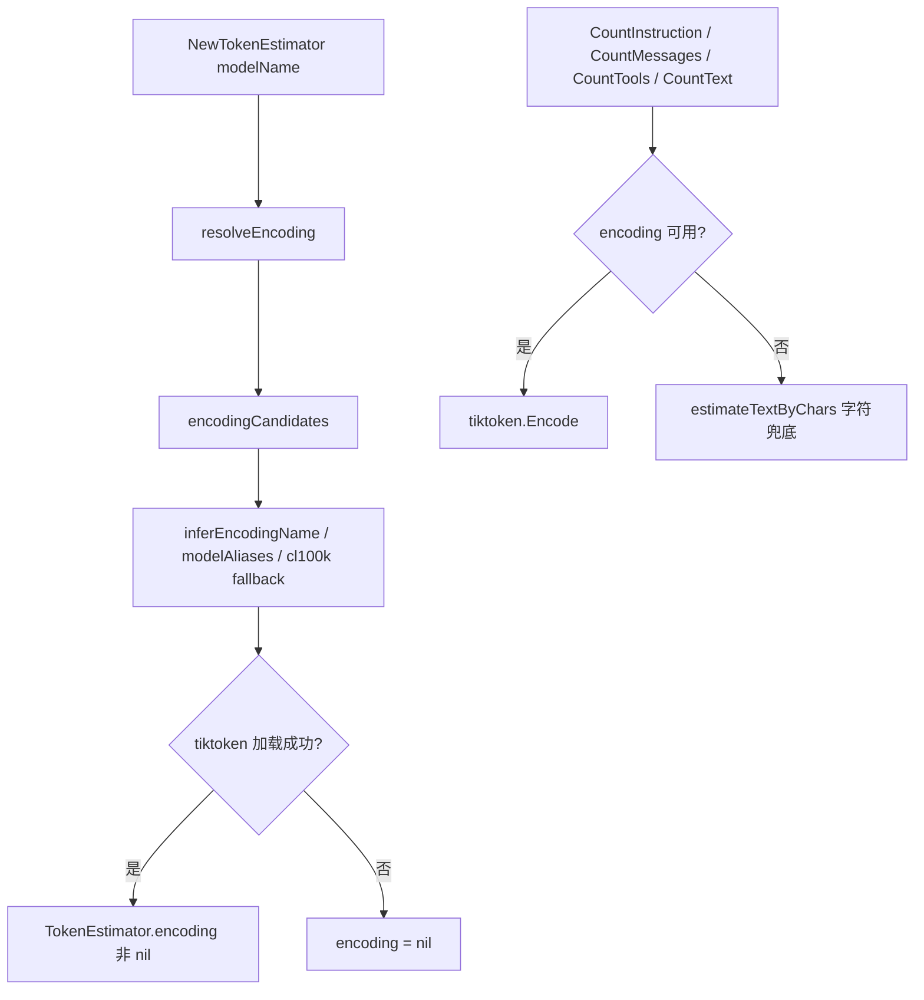
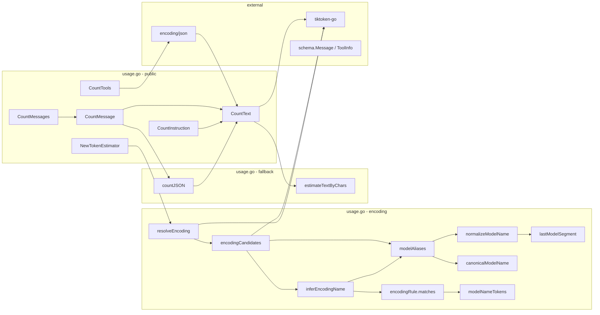

# common 包

上下文子系统的共享基础设施，当前提供 **TokenEstimator** 与 **ContextBudget**：在本地估算模型可见 prompt 的 token 数，供上下文压缩与状态行监视使用。

设计目标：

- 优先使用 **tiktoken BPE** 计数，贴近 OpenAI chat 格式的 token 开销模型
- 兼容 OpenAI 兼容网关的 **厂商/路径前缀模型名**（如 `openrouter/anthropic/claude-3.5-sonnet`）
- 对未知模型 **保守回退到 cl100k**，仅在 tiktoken 完全不可用时才用字符粗估

主要消费者：

- [`internal/context/compact`](../compact/README.md) 在 `CompactIfNeeded` 中调用 `CountMessages` / `CountTools` 决定是否触发压缩。
- `internal/middlewares` 的 budget middleware 调用 `EstimateBudget` 生成分段快照，供终端状态行展示。

Eino 的 `defaultGenModelInput` 会将 Instruction 以 `SystemMessage` 注入消息列表，因此 `CountMessages` 已天然包含 Instruction 开销，compact 包无需单独跟踪。状态行预算会按模型调用前的实际可见 ctx 拆分展示，避免双重计数。

状态行分段口径：

| 状态标签 | Segment | 含义 |
|----------|---------|------|
| `sys` | `SegmentSystem` | 静态模型上下文，包括 Eino 注入的 system / Instruction 和已注册工具 schema |
| `conv` | `SegmentConversation` | 普通 user / assistant 对话消息 |
| `tools` | `SegmentTools` | 实际工具调用请求与工具结果消息 |
| `rules` / `skills` / `mcp` / `sub` | 预留分段 | 后续规则、技能、MCP、subagent 上下文 |

工具定义本身会作为能力说明进入模型 prompt，但它不是一次工具调用产生的消息，因此状态行把这部分固定成本并入 `sys`；`tools` 只有发生工具调用或工具结果进入消息历史时才出现。

---

## 估算流程



### 对外 API 一览

| 方法 | 说明 |
|------|------|
| `NewTokenEstimator(modelName)` | 根据 API 模型名创建估算器，内部解析 tiktoken 编码 |
| `CountMessages(messages)` | 全部消息 token + 非空时的 reply priming 开销 |
| `CountMessage(msg)` | 单条消息 token（含 role、content、tool calls、多模态 JSON 等） |
| `CountTools(tools)` | 工具 schema JSON 序列化后的 token 总和 |
| `CountInstruction(text)` | 静态 system instruction 等纯文本 token |
| `CountText(text)` | 任意文本 token（BPE 或字符兜底） |

---

## 文件职责

| 文件 | 内容 |
|------|------|
| `usage.go` | `TokenEstimator`、编码解析、模型名归一化、OpenAI chat framing 常量 |
| `budget.go` | `ContextBudget`、分段类型、`EstimateBudget` |
| `budget_ctx.go` | `BudgetWriter` 与 context 传递 helpers |
| `usage_test.go` | 编码推断、模型别名、消息开销的单元测试 |
| `budget*_test.go` | 分段预算与快照槽位测试 |

---

## 函数调用关系

### 总览（以 `NewTokenEstimator` 与 `CountText` 为根）

```text
NewTokenEstimator(modelName)
  └── resolveEncoding(modelName)
        └── encodingCandidates(modelName)
              ├── modelAliases(modelName)
              │     ├── canonicalModelName(...)
              │     └── normalizeModelName(...)
              │           ├── lastModelSegment(...)
              │           └── canonicalModelName(...)
              ├── inferEncodingName(modelName)
              │     ├── modelAliases(...)
              │     └── encodingRule.matches(aliases)
              │           └── modelNameTokens(...)
              └── tiktoken.EncodingForModel / GetEncoding (候选列表依次尝试)

CountMessages(messages)
  ├── CountMessage(msg) × N
  │     ├── CountText(role, name, content, reasoning, tool fields...)
  │     └── countJSON(multi-content parts)
  │           └── CountText(JSON string)
  └── + replyPrimingTokens (messages 非空时)

CountTools(tools)
  └── json.Marshal(tool) → CountText

CountText(text)
  ├── encoding.Encode (BPE，encoding 非 nil)
  └── estimateTextByChars (encoding 为 nil 时的最后兜底)
```

### 调用关系图



---

## 各函数说明

### 导出 API

| 函数 | 说明 |
|------|------|
| `NewTokenEstimator` | 构造估算器；`modelName` 来自运行时 API 配置（如 `HAPPLADYSAUCECLI_MODEL`） |
| `CountMessages` | 遍历消息累加 `CountMessage`，并在 `len(messages) > 0` 时加 `replyPrimingTokens`（3） |
| `CountMessage` | 单条消息的 OpenAI chat framing + 各字段 token |
| `CountTools` | 每个 `ToolInfo` 做 `json.Marshal` 后计数；序列化失败返回 error |
| `CountInstruction` | `CountText` 的语义别名，用于 system prompt 等静态文本 |
| `CountText` | 核心文本计数入口 |
| `EstimateBudget` | 基于模型可见 messages/tools 生成分段 token 快照 |
| `NewBudgetWriter` | 创建线程安全的预算快照槽位 |

### 单条消息计数（CountMessage）

每条消息固定开销：

```text
tokensPerMessage = 3    # role/content 等 framing
tokensPerName    = 1    # 仅当 msg.Name 非空时额外加 1 + CountText(name)
```

计入 token 的字段：

| 字段 | 来源 |
|------|------|
| `Role` | 字符串形式 |
| `Name` | 可选 |
| `Content` | 正文 |
| `ReasoningContent` | 推理内容 |
| `ToolCallID` / `ToolName` | tool 消息 |
| `ToolCalls[]` | ID、Type、Function.Name、Function.Arguments |
| `UserInputMultiContent` 等 | JSON 序列化后计数 |

### 编码解析（私有）

| 函数 | 说明 |
|------|------|
| `resolveEncoding` | 按候选列表依次尝试 `EncodingForModel` / `GetEncoding`，全部失败返回 `nil` |
| `encodingCandidates` | 构建去重候选：`modelName` → aliases → 推断编码名 → `cl100k_base` |
| `inferEncodingName` | 按 `encodingRules` 顺序匹配，返回 `o200k_base` 或 `cl100k_base` |
| `encodingRule.matches` | 精确名、前缀、family token 三种匹配，避免不安全的子串误匹配 |
| `modelAliases` | 返回 `[lastSegment, fullCanonical]` 或仅 `[full]` |
| `normalizeModelName` | 去厂商路径前缀并规范化分隔符 |
| `lastModelSegment` | 取最后一个 `/` 后的模型段（OpenAI 兼容网关惯例） |
| `canonicalModelName` | 小写 + 将 `/:_` 等统一为 `-`，保留版本点号 |
| `modelNameTokens` | 按分隔符切分 token，供 family 匹配使用 |
| `countJSON` | 多模态 part 的 JSON token 估算 |
| `estimateTextByChars` | `utf8.RuneCount / 4` 向上取整，最少 1 token |

---

## 编码映射规则（encodingRules）

规则 **顺序敏感**：较新的 OpenAI 族必须排在宽泛 GPT-4 规则之前。

### o200k_base

| 匹配方式 | 示例 |
|----------|------|
| 精确名 | `gpt-4o`, `gpt-4.1`, `o1`, `o3`, `o4` |
| 前缀 | `gpt-4o-`, `o3-`, `gpt-4.1-` |
| 网关别名 | `openrouter/openai/gpt-4.1-mini`, `azure/openai/o3-mini` |

### cl100k_base

| 匹配方式 | 示例 |
|----------|------|
| OpenAI 旧族 | `gpt-4`, `gpt-3.5-turbo`, `text-embedding-3-large` |
| 第三方 family token | `claude`, `gemini`, `deepseek`, `qwen`, `llama`, `mistral`, `kimi` 等 |
| family 前缀 | `claude`, `gemini`, `deepseek`, `llama` 等 |

### 未知模型

`encodingCandidates` 末尾始终追加 `cl100k_base`，因此绝大多数未知模型名仍会走 **BPE 计数**，而非字符 fallback。字符 fallback 仅在 tiktoken 库完全无法加载任何编码时触发（`encoding == nil`）。

---

## 常量

| 常量 | 值 | 含义 |
|------|-----|------|
| `fallbackCharsPerToken` | 4 | 字符兜底时的 rune/token 比 |
| `tokensPerMessage` | 3 | 每条消息的 chat framing 开销 |
| `tokensPerName` | 1 | 带 `name` 字段的额外开销 |
| `replyPrimingTokens` | 3 | 非空消息列表的 assistant 回复预置开销 |

---

## 在 compact 中的使用

```text
compact.NewCompactor(cfg)
  └── common.NewTokenEstimator(cfg.ModelName)

compact.Compactor.CompactIfNeeded(...)
  └── estimateTotalTokens(messages, tools)
        ├── estimator.CountMessages(messages)   # 含 Eino 注入的 SystemMessage(Instruction)
        └── estimator.CountTools(tools)         # 工具 schema 计入 prompt
  └── estimator.CountMessages(boundary.middle)  # 传给摘要 prompt 的估算 token
```

压缩触发比较的是 **消息（含 Instruction 和工具调用消息）+ 工具 schema** 的本地估算值，与 provider 实际 billing 可能略有偏差；估算仅用于内部决策，不对外承诺精确计数。

---

## 设计约束与注意事项

1. **本地估算，非 billing 真相** — 不同厂商 tokenizer 与 OpenAI BPE 不完全一致；cl100k 对 Claude/Gemini 等是保守近似。
2. **Instruction 天然计入消息列表** — Eino 的 `defaultGenModelInput` 将 Instruction 注入为 `SystemMessage`；`CountMessages` 直接计完整 `state.Messages`，compact 无需单独跟踪 Instruction。
3. **System 保留但不参与摘要** — 压缩边界只处理非 system 上下文；压缩输出会把原 system messages prepend 回去，保证同一个 ReAct/tool loop 内后续模型调用仍看到 Instruction。
4. **工具定义并入静态上下文** — 注册工具 schema 是固定 prompt 成本，状态行归入 `sys`；`tools` 只表示实际 tool call / tool result 消息成本。
5. **family 匹配用 token 边界** — 避免 `biology-o10-research` 之类误匹配 `o1` 系列（见 `TestInferEncodingDoesNotUseUnsafeSubstringMatching`）。
6. **CJK 文本** — 未知模型走 cl100k BPE 时，中文 token 数通常 **大于** 字符 fallback，压缩会更早触发，属保守行为。

---

## 相关文档

- 压缩流程（消费方）：[`internal/context/compact/README.md`](../compact/README.md)
- 设计总览：[`docs/context/compression.md`](../../../docs/context/compression.md)
