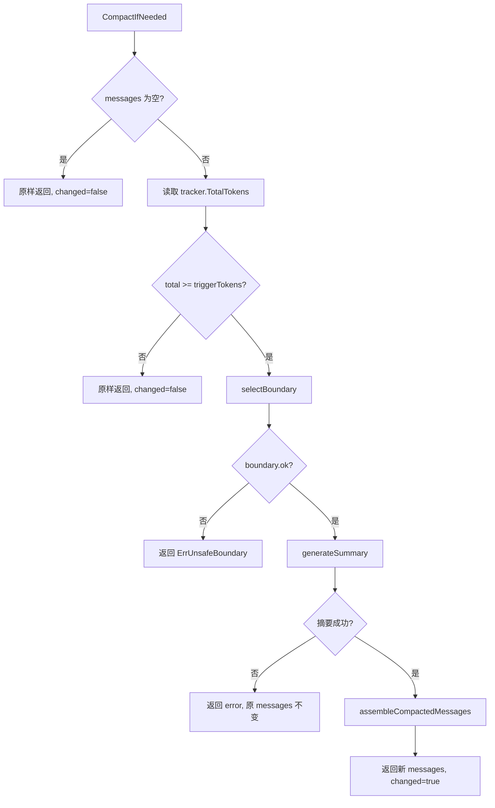
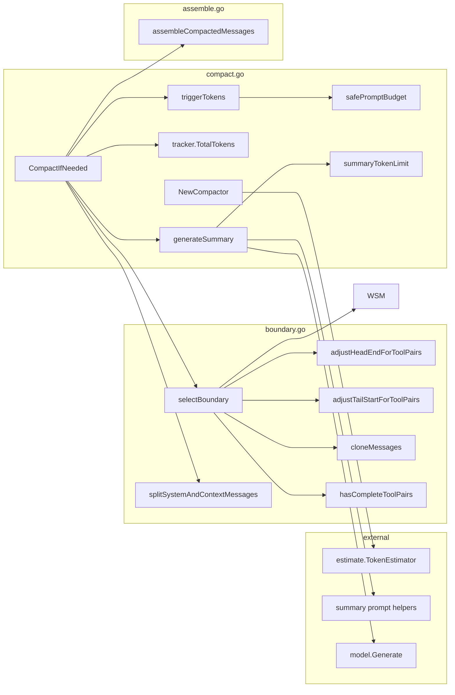

# compact 包

Hermes 风格的语义上下文压缩：当 provider 返回的上下文窗口占用 `tracker.TotalTokens()` 接近模型窗口上限时，将对话历史切分为 **head / middle / tail**，对 middle 段调用辅助模型生成结构化摘要，再组装为 `[system, head, summary, tail]` 供后续模型调用使用。

上层集成：`internal/middlewares/compact/compact.go` 在每次 `BeforeModelRewriteState` 钩子中调用 `Compactor.CompactIfNeeded()`。

---

## 压缩流程



### 阶段说明

| 阶段 | 职责 | 关键函数 |
|------|------|----------|
| 1. 压力检测 | 读取 ChatModel 层写入的 provider context total，与安全窗口水位比较 | `tracker.TotalTokens`, `triggerTokens`, `safePromptBudget` |
| 2. 边界切分 | 拆分并保留 system 消息，仅对非 system 上下文划分 head/middle/tail，保证 tool 配对完整 | `splitSystemAndContextMessages`, `selectBoundary` |
| 3. 中间段摘要 | 调用主模型生成六段式结构化摘要 | `generateSummary`, `summaryTokenLimit` |
| 4. 结果组装 | 不修改原消息，拼接 `[system, head, summary, tail]` | `assembleCompactedMessages` |

### 触发条件

```text
safePromptBudget = maxContextTokens - maxOutputTokens
triggerTokens    = safePromptBudget × 80%
```

当 `tracker.TotalTokens() >= triggerTokens` 时进入压缩。终端统计行中的 `content` 显示同一个上下文窗口占用值；`total↑↓` 只表示当前用户交互内所有 model turn 的 provider total 聚合值，不参与压缩触发。本地估算只用于生成摘要 prompt 时提示 middle 段规模。

### 默认边界参数

| 常量 | 值 | 含义 |
|------|-----|------|
| `defaultHeadMessages` | 2 | 非 system 上下文中保留的头部消息数 |
| `defaultTailMessages` | 4 | 尾部至少保留的最近消息数 |
| `compactionTriggerPercent` | 80 | 触发压缩的安全上下文预算比例 |
| `defaultSummaryTokens` | 4096 | 摘要输出 token 上限（大模型场景） |
| `minimumSummaryTokens` | 512 | 摘要输出 token 下限（小 max output 场景） |

摘要输出上限由 `summaryTokenLimit()` 动态计算：`maxOutputTokens / 4`，并 clamp 到 `[512, 4096]`。

---

## 文件职责

| 文件 | 内容 |
|------|------|
| `compact.go` | `Compactor` 类型、入口 `CompactIfNeeded`、provider total 压力检测与摘要生成 |
| `boundary.go` | head/middle/tail 切分及 tool call/result 配对保护 |
| `assemble.go` | 压缩结果消息列表组装 |
| `compact_test.go` | 单元测试 |

---

## 函数调用关系

### 总览（以 `CompactIfNeeded` 为根）

```text
NewCompactor(cfg)
  └── estimate.NewTokenEstimator(modelName)   # 仅用于 middle 段摘要规模提示

CompactIfNeeded(ctx, messages, sessionTotal)
  ├── sessionTotal from tracker.TotalTokens()
  ├── triggerTokens()
  │     └── safePromptBudget()
  ├── splitSystemAndContextMessages(messages)     [boundary.go]
  ├── selectBoundary(contextMessages)             [boundary.go]
  │     ├── adjustHeadEndForToolPairs(...)
  │     ├── adjustTailStartForToolPairs(...)
  │     ├── cloneMessages(...) × 3
  │     └── hasCompleteToolPairs(head/tail)
  ├── generateSummary(ctx, middle, middleTokens)
  │     ├── summaryTokenLimit()
  │     ├── summarySystemPrompt
  │     ├── summaryUserPrompt(...)
  │     └── model.Generate(...)
  └── assembleCompactedMessages(system, head, summary, tail)  [assemble.go]
```

### 调用关系图



---

## 各函数说明

### compact.go

| 函数 | 可见性 | 说明 |
|------|--------|------|
| `NewCompactor` | 导出 | 校验配置，创建 `Compactor` |
| `CompactIfNeeded` | 导出 | **主入口**：检测压力 → 切分 → 摘要 → 组装 |
| `triggerTokens` | 私有 | 返回 80% 安全预算水位线 |
| `safePromptBudget` | 私有 | `maxContextTokens - maxOutputTokens` |
| `summaryTokenLimit` | 私有 | 摘要模型的 `MaxTokens` 上限 |
| `generateSummary` | 私有 | 构造压缩 prompt，调用模型，返回带前缀的 user 摘要消息 |

### boundary.go

| 函数 | 可见性 | 说明 |
|------|--------|------|
| `splitSystemAndContextMessages` | 包内 | 拆分 system messages 与可压缩上下文 |
| `selectBoundary` | 包内 | 在非 system 上下文中选择 head/middle/tail；失败时 `ok=false` |
| `adjustHeadEndForToolPairs` | 包内 | head 内未闭合的 tool_call 需把对应 result 纳入 head |
| `adjustTailStartForToolPairs` | 包内 | tail 内 tool_result 需把对应 assistant 纳入 tail |
| `hasCompleteToolPairs` | 包内 | 校验 segment 内 tool_call 与 tool_result 一一配对 |
| `cloneMessages` | 包内 | 浅拷贝消息，避免污染原历史 |

### assemble.go

| 函数 | 可见性 | 说明 |
|------|--------|------|
| `assembleCompactedMessages` | 包内 | 按顺序拼接 system、head、summary（可选）、tail |

---

## 边界切分算法（selectBoundary）

```text
messages (非 system context)
├── head   : messages[0 : headEnd)           默认 2 条
├── middle : messages[headEnd : tailStart)   待摘要
└── tail   : messages[tailStart : ]          默认 4 条
```

处理顺序：拆分 system → 长度校验 → 初始切点 → head 扩展（tool 配对）→ tail 收缩（tool 配对）→ 克隆与校验。任一环节失败 → `compactionBoundary{ok: false}` → `ErrUnsafeBoundary`。

---

## 摘要生成（generateSummary）

输入为 middle 段消息，构造 system + user 两条 prompt，调用 `model.Generate`。输出为 **user 角色**消息，前缀 `summaryPrefix`，以便后续压缩轮次不会被当作 system 过滤。

建议摘要结构：`Goal` / `Constraints` / `Progress` / `Decisions` / `Relevant Files` / `Next Steps`。

---

## 返回值与错误语义

```go
func (c *Compactor) CompactIfNeeded(
    ctx context.Context,
    messages []*schema.Message,
    sessionTotal int,
) (next []*schema.Message, changed bool, err error)
```

| 场景 | `next` | `changed` | `err` |
|------|--------|-----------|-------|
| 未达触发水位 | 原 messages | `false` | `nil` |
| 压缩成功 | `[system, head, summary, tail]` | `true` | `nil` |
| 边界不安全 | 原 messages | `false` | `ErrUnsafeBoundary` |
| 摘要失败 | 原 messages | `false` | 非 nil error |
Middleware 在 `err != nil` 时记录 warning 并透传原 state，不中断 agent 运行。

---

## 外部依赖

| 包 | 用途 |
|----|------|
| `internal/context/tracker` | provider context total 压力信号 |
| `pkg/context/estimate` | `TokenEstimator` 的实际实现 |
| `pkg/context/compact/prompts.go` | 压缩 system/user prompt 与摘要前缀 |
| `github.com/cloudwego/eino/components/model` | `Generate` 生成摘要 |
| `github.com/cloudwego/eino/schema` | 消息与工具类型 |

---

## 相关文档

- Middleware 集成：[`internal/middlewares/compact/compact.go`](../../../internal/middlewares/compact/compact.go)
- Token 估算：[`pkg/context/estimate/estimate.go`](../estimate/estimate.go)
- 终端统计行：[`internal/terminal/budget/README.md`](../../../internal/terminal/budget/README.md)
- 创建 Compactor：[`internal/middlewares/middleware.go`](../../../internal/middlewares/middleware.go)
